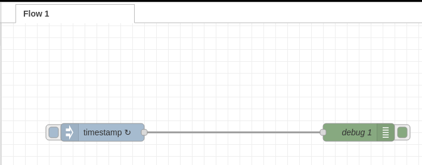
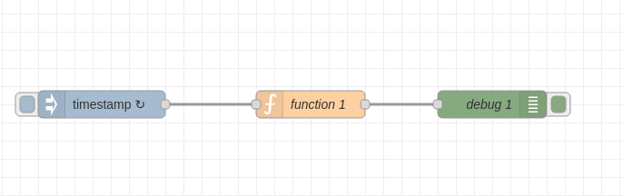
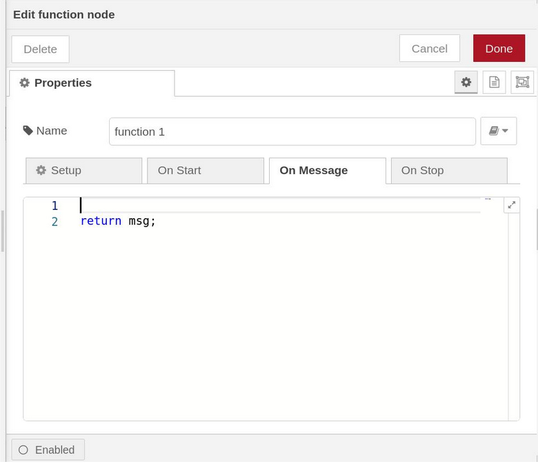
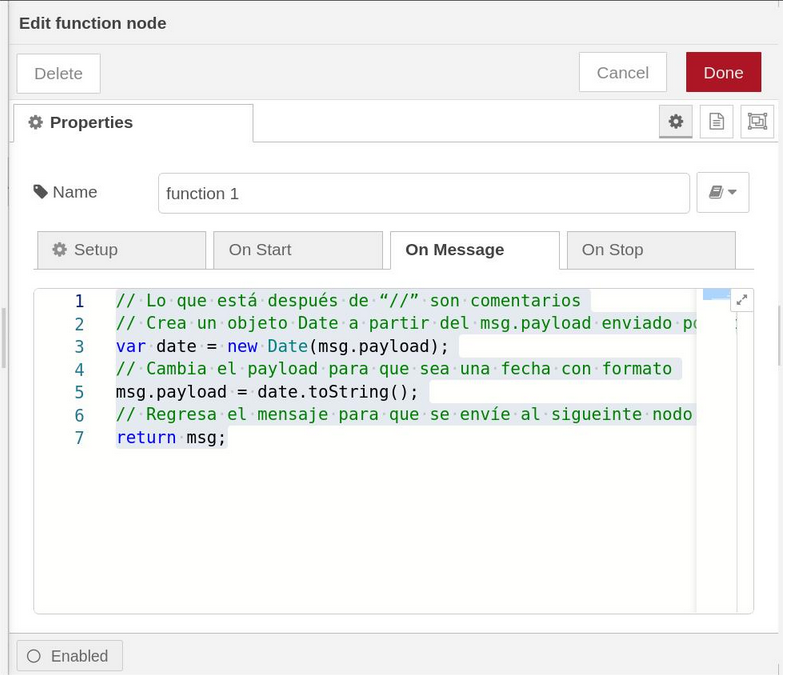
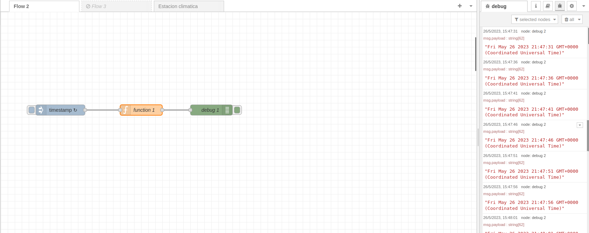

# Flow2 Ejercicio con nodo Function
Este repositorio contiene el segundo flow con NodeRed

# Descripción
El segundo ejercicio que se realizara en Node-Red consiste en darle un formato legible para humanos al timestamp utilizando un nodo function para mostrar la fecha en la sección debug. Partiremos del resultado del ejercicio Marca de tiempo con nodos inject y Debug. Si no lo tienes lo puedes descargar de nuestro GitHub: https://github.com/codigo-iot/flow1-NodeRed

El punto de partida sera el siguiente flow




# Preparacion

docker start [id_del_contenedor_de_node_red]

Reemplaza la id_del_contenedor con la del contenedor correspondiente a Node-Red. Si no recuerdas cuál es puedes usar el siguiente comando para ver todos los contenedores.

docker ps -a[termina código]

Nota: Si instalaste el contenedor de acurdo con el ejercicio [Creación de una Aplicación Multi-Contenedor con Docker](https://edu.codigoiot.com/mod/lesson/view.php?id=3889&pageid=3804) la Id será algo como: dockercompose-nodered-1

Una vez arrancado Node-Red abre un navegador y entra a la URL localhost:1880

# Nodo Function

 El nodo function nos permite manipular el contenido del objeto msg que le llega escribiendo código en Javascript. En este caso lo utilizaremos para darle formato a la fecha.

Inserta un Nodo function de la paleta de nodos y conecta su entrada a la salida de inject y su salida a la entrada de debug.



Da doble click en el nodo para ver su configuración.



Verás las siguientes propiedades:

- __Name__: El nombre del nodo que se mostrará en la interfaz

Y también las siguientes pestañas:

- __Setup__: Configura el número de salidas del nodo y los módulos externos que usa

- __On Start__: El código escrito acá correrá una vez al iniciar el flow

- __On Message__: El código escrito acá correrá cada vez que se reciba una entrada

- __On Stop__: El código escrito aquí correrá al parar el flow.

Verás también un área de escritura con renglones numerados. Aquí escribirás tu código.

# Codigo

 En la pestaña On Message escribe el siguiente código en el área de texto:

 ```
 // Lo que está después de "//" son comentarios 
 // Crea un objeto Date a partir del msg.payload enviado por timestamp 
 var date = new Date(msg.payload); // Cambia el payload para que sea una fecha con formato 
 msg.payload = date.toString(); // Regresa el mensaje para que se envíe al siguiente nodo return msg; 
 ```


# Deploy y resultados

 Es hora de dar click en el botón deploy. Si revisas la consola de depuración (ícono de insecto) verás que la hora esta con formato legible y ya no en UNIX.



¡Enhorabuena! Has terminado el ejercicio. Recuerda que los nodos function nos sirven para escribir funciones propias cuando no existe un nodo que cumpla lo que deseamos. Para más información consulta la documentación sobre funciones.

